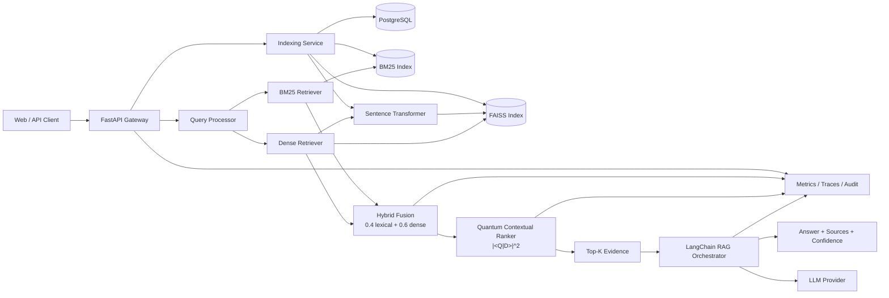

# System Architecture

## Context

The system separates durable content, retrieval indexes, ranking logic, and
answer generation. PostgreSQL is the system of record. BM25 and FAISS are
rebuildable search projections. This makes index recovery deterministic and
keeps model-specific artifacts out of transactional storage.

## Indexing flow

1. Validate and deduplicate documents using canonical URL and content hash.
2. Persist the document and chunk records transactionally.
3. Generate chunk embeddings in batches.
4. write lexical fields to the BM25 index.
5. Append normalized vectors to the FAISS index.
6. Commit index version metadata only after both projections succeed.
7. Mark the indexing job complete; failed jobs remain retryable.

## Search flow

1. Normalize the query and detect optional filters.
2. Run BM25 and dense retrieval concurrently with a larger candidate pool.
3. Min-max normalize scores per retriever.
4. Fuse candidates with `0.4 * BM25 + 0.6 * dense`.
5. Build normalized query and document states.
6. Compute quantum similarity `P = |<Q|D>|^2`.
7. Blend quantum relevance with context coherence and the hybrid prior.
8. Return ranked results with an explicit score explanation.

## RAG flow

`/ask` uses the same search pipeline, applies evidence diversity and token
budgeting, then sends a citation-aware prompt to the configured LLM. The
response includes:

- generated answer
- source documents and chunk identifiers
- confidence calibrated from evidence coverage, ranking margin, and citation
  support
- request identifier for traceability

## Reliability decisions

- API routes do not import concrete model providers.
- Index writes are versioned and recoverable from PostgreSQL.
- Scores are normalized before fusion.
- Every result exposes lexical, dense, hybrid, quantum, contextual, and final
  scores.
- Request IDs propagate through logs and responses.
- Secrets are environment-driven and never committed.
- Health and readiness endpoints are separate.

## Scaling path

- Run indexing workers separately from API replicas.
- Shard FAISS by corpus or tenant and merge top-k results.
- Replace in-process BM25 with OpenSearch for distributed lexical search.
- Use Redis for query/result caching.
- Add OpenTelemetry and Prometheus exporters.
- Calibrate confidence and ranking weights on a labeled evaluation set.
